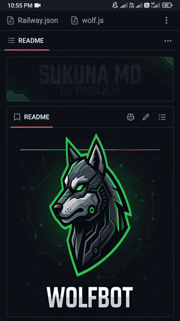

<p align="center">
  <a href="https://github.com/pasquawisdom2007-beep/SUKUNA_MD">
    
  </a>
</p>

<h1 align="center">SUKUNA MD</h1>

<p align="center"><strong>by PASQUA</strong></p>

<p align="center">
  <em>The King of Curses — a panel-paired WhatsApp MD bot.</em>
</p>

<p align="center">
  <a href="https://github.com/pasquawisdom2007-beep/SUKUNA_MD/stargazers"></a>
  <a href="https://github.com/pasquawisdom2007-beep/SUKUNA_MD/network/members"></a>
  <a href="https://github.com/pasquawisdom2007-beep/SUKUNA_MD/watchers"></a>
  <a href="https://github.com/pasquawisdom2007-beep/SUKUNA_MD"></a>
</p>

<p align="center">
  <a href="https://github.com/pasquawisdom2007-beep/SUKUNA_MD/blob/main/assets/branding/sukuna-pasqua-branded.mp4">
    
  </a>
</p>

<p align="center"><sub>Click the animation preview to open the full branded MP4.</sub></p>

---

## About

**SUKUNA MD** is a multi-user WhatsApp bot built around panel-friendly pairing, modular commands, group administration, utilities, media tools, and independent protection engines. The project is maintained by **PASQUA** and uses the Pasqua Baileys fork configured by the repository.

The visual identity in this README follows the dark cinematic presentation shown in the project reference: a strong central brand image, restrained cyan accents, and a short animated title treatment reading **SUKUNA MD — by PASQUA**.

## Highlights

| Area | Included direction |
|---|---|
| Pairing | Panel-friendly WhatsApp number pairing with saved sessions and reconnect support |
| Commands | Modular command loader with configurable prefixes and command categories |
| Groups | Administration, moderation, member tools, media protection, and group utilities |
| Media | Stickers, downloads, image/video tools, previews, and other media commands |
| Protection | Independent AntiBot handling and separate Guard functionality |
| Deployment | Pterodactyl, VPS, and other Node.js-capable hosting environments |

## How pairing works

1. Deploy the repository on Pterodactyl, a VPS, or another Node.js-capable host.
2. Start the bot with the command shown in the deployment section below.
3. Follow the console prompt:

```text
[PAIR] Enter WhatsApp number with country code:
```

4. Enter the WhatsApp number with its country code, without spaces or symbols. For example:

```text
2349127857212
```

5. The bot generates an eight-character pairing code in the following format:

```text
XXXX-XXXX
```

6. On WhatsApp, open **Linked Devices**, choose **Link with Phone Number**, and enter the displayed code.
7. The session is saved under the configured sessions directory and restored automatically after a restart.

## Pair additional numbers

To pair another account, type `y` when the panel asks whether another number should be paired, or restart the process and provide a new number. Existing sessions remain available and are restored automatically.

## Pterodactyl deployment

### Requirements

- Node.js 18 or newer
- A panel or container with permission to install dependencies and persist the sessions directory

### Setup

```bash
npm install --omit=dev
```

### Start

```bash
node index.js
```

### Optional environment variables

| Variable | Purpose |
|---|---|
| `OWNER_NUMBER` | Owner WhatsApp number used by owner-only features |
| `PAIR_NUMBER` | Number to pair automatically on boot |
| `OPENAI_API_KEY` | OpenAI-powered integrations that require it |
| `WEATHER_API_KEY` | Weather integrations that require it |

If the panel does not support interactive console input, set `PAIR_NUMBER` before starting:

```bash
PAIR_NUMBER=2349127857212 node index.js
```

## VPS deployment

```bash
git clone https://github.com/pasquawisdom2007-beep/SUKUNA_MD.git
cd SUKUNA_MD
npm install --omit=dev
node index.js
```

For a headless start:

```bash
PAIR_NUMBER=2349127857212 node index.js
```

A process manager such as `pm2`, `systemd`, or `screen` can be used to keep the bot running after the terminal closes.

## Repository structure

```text
index.js                    Entry point
config.js                   Runtime configuration
lib/
  sessionManager.js         WhatsApp session and connection manager
  gameLobby.js              Game system
commands/                   Modular command collection
utils/                      Shared utilities and protection engines
assets/
  branding/                 README and project branding media
data/                       Runtime data and persisted settings
sessions/                   Saved WhatsApp sessions
```

## Branding assets

The README branding files are kept in [`assets/branding`](./assets/branding):

| File | Purpose |
|---|---|
| [`sukuna-pasqua.jpg`](./assets/branding/sukuna-pasqua.jpg) | Supplied PASQUA reference image used as the README hero visual |
| [`sukuna-pasqua-branded.gif`](./assets/branding/sukuna-pasqua-branded.gif) | Lightweight animated README preview with the Sukuna MD title treatment |
| [`sukuna-pasqua-branded.mp4`](./assets/branding/sukuna-pasqua-branded.mp4) | Full vertical branded animation linked from the README preview |

## Credits

```yaml
Creator: PASQUA
Bot Name: SUKUNA MD
Repository: pasquawisdom2007-beep/SUKUNA_MD
Library: @pasqua-baileys/baileys
```

## License

```text
MIT License
```

<p align="center">
  <strong>SUKUNA MD</strong><br>
  <sub>by PASQUA · The King of Curses</sub>
</p>
